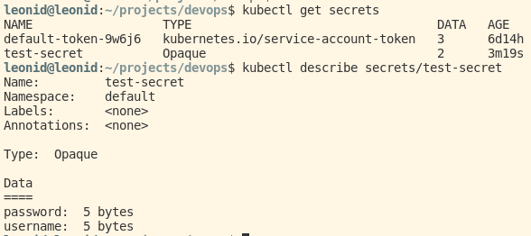
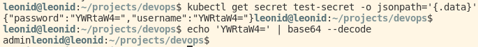
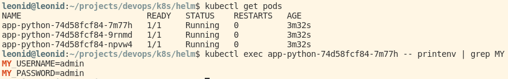
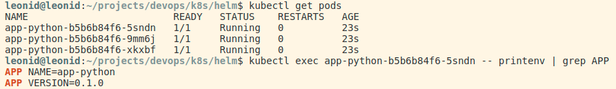

# Managing secrets

## With kubectl

1. Create a secret with some key-value pairs

```bash
kubectl create secret generic test-secret --from-literal username=admin --from-literal password=admin
```


1. Get info about secret

```bash
kubectl get secrets
kubectl describe secrets/test-secret
```



1. Decode secrets

```bash
kubectl get secret test-secret -o jsonpath='{.data}'
echo 'ENCODED_DATA' | base64 --decode
```



## With helm

1. Install app-python chart

1. Verify

```bash
kubectl get pods
kubectl exec $POD_NAME -- printenv | grep MY
```



## Bonus: helm env

Added env template in `_helpers.tpl`


