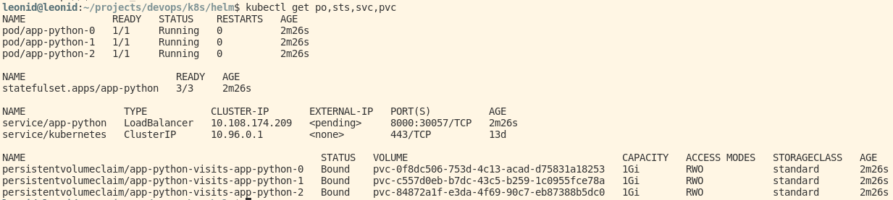
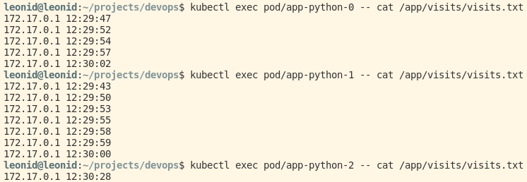

# K8s StatefulSet

After packaging and installing the chart check the output:

Check `visits.txt` file in each pod after accessing the root path of the app several time :

We can see that visists data is different in each pod. This happens because each pod has its own persistent volume with a `volumes.txt` file inside and these volumes are independent of each other.

## Ordering guarantee

By default StatefulSet provides ordering guarantees. They are useful when deploying applications which depend on each other, i.e. order is important. But in our case, all pods are independent, so we can use parallel `podManagementPolicy`.
