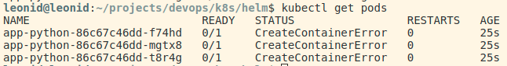
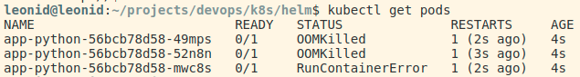
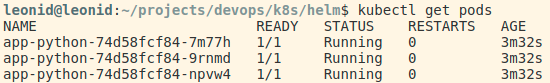

# Deployment description

## CLI deployment

```bash
kubectl create deployment app-python --image=lok52/app_python:latest
kubectl expose deployment app-python --type=LoadBalancer --port=8000
```


## Deployment via configuration files

```bash
kubectl apply -f k8s/app-python/
```


## Bonus: deployment of extra app

```bash
kubectl apply -R -f ./k8s
```


## Helm

```bash
helm package app-python
helm package app-rust

helm install app-python ./app-python-0.1.0.tgz
helm install app-rust ./app-rust-0.1.0.tgz
```


## Resource management

If we try to specify memory limit less then 6MB we will get the `CreateContainerError`:



If there is not enogh memory for python application we will see `OOMKilled`:



Otherwise everything works correctly:


