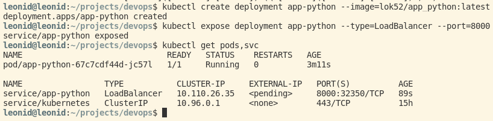
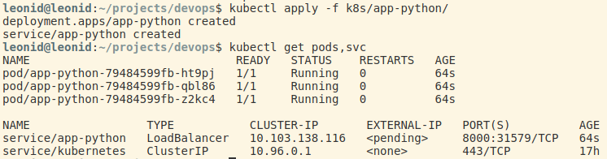
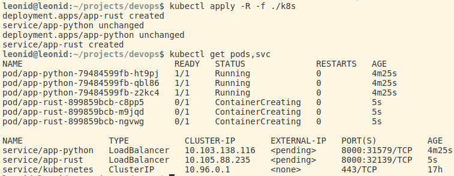
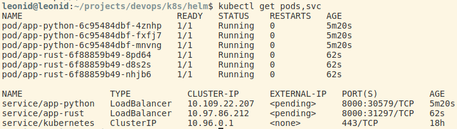

# Deployment description

## CLI deployment

```bash
kubectl create deployment app-python --image=lok52/app_python:latest
kubectl expose deployment app-python --type=LoadBalancer --port=8000
```



## Deployment via configuration files

```bash
kubectl apply -f k8s/app-python/
```



## Bonus: deployment of extra app

```bash
kubectl apply -R -f ./k8s
```



## Helm

```bash
helm package app-python
helm package app-rust

helm install app-python ./app-python-0.1.0.tgz
helm install app-rust ./app-rust-0.1.0.tgz
```


