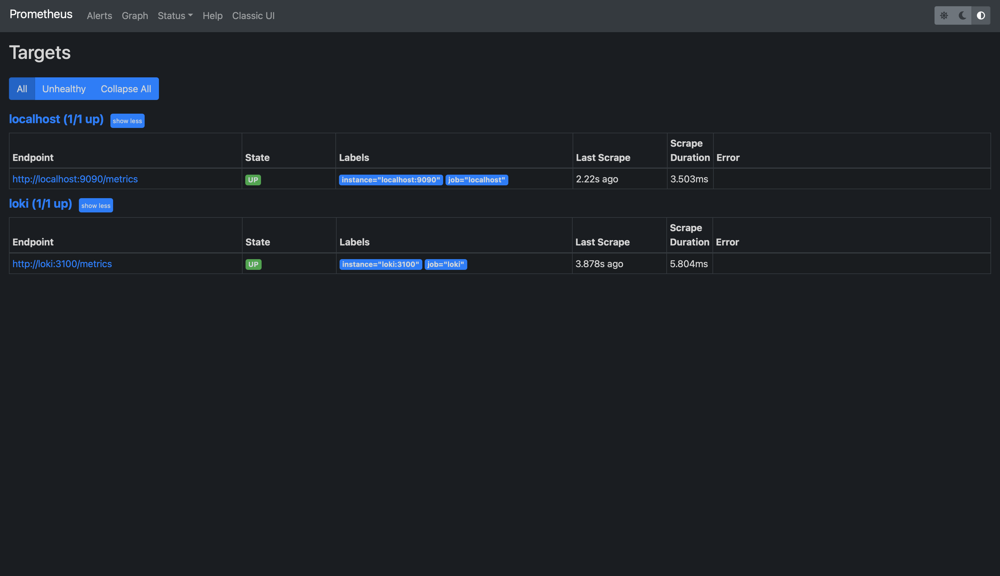
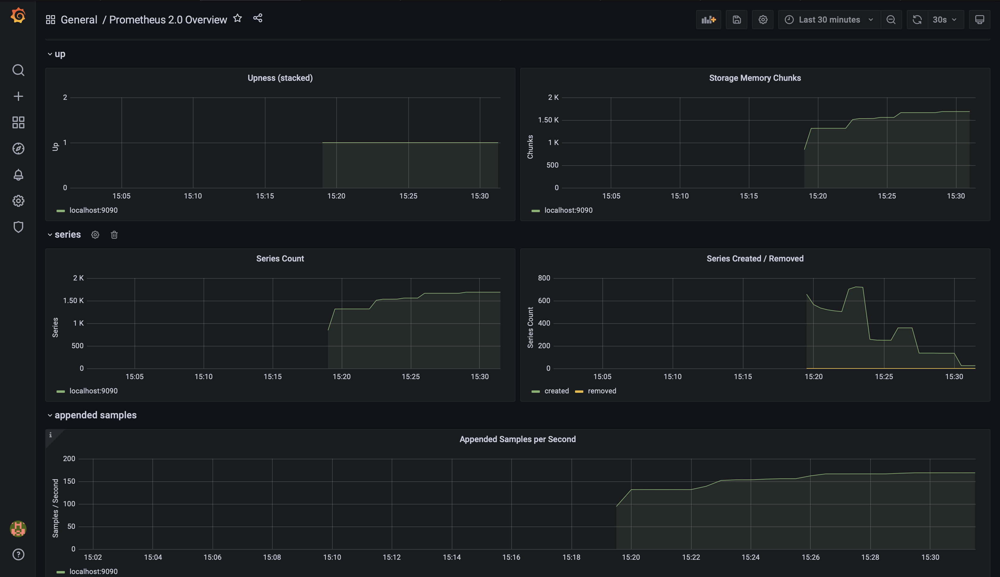
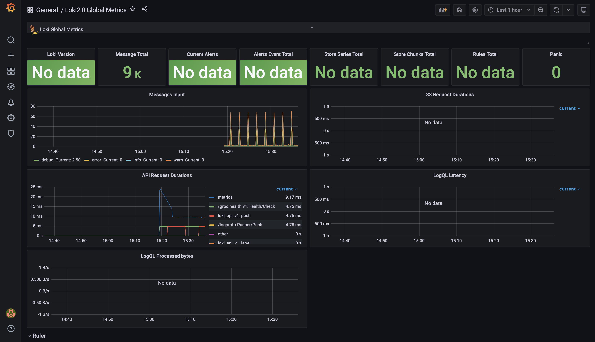

# Logging

## Screenshots

Logs from *app_python* and from *app_rust*

Prometheus targets

Graphana dashboards

## Loggng best practices

* Use tags to logically separate metrics and create dashboards
* Do not export uselss logs. Use filters in scrapping configs
* Use limits for logs size, e.g. in docker logging config
* Dedicate enough storage for logs
* If using docker for logging stack make sure to save logs in volumes
* Make sure permisions for log sourses are correct
* Use log levels to correctly monitor errors and warnings
* Enable log rotation to avoid overflowing the record store,
    while keeping the log files small enough